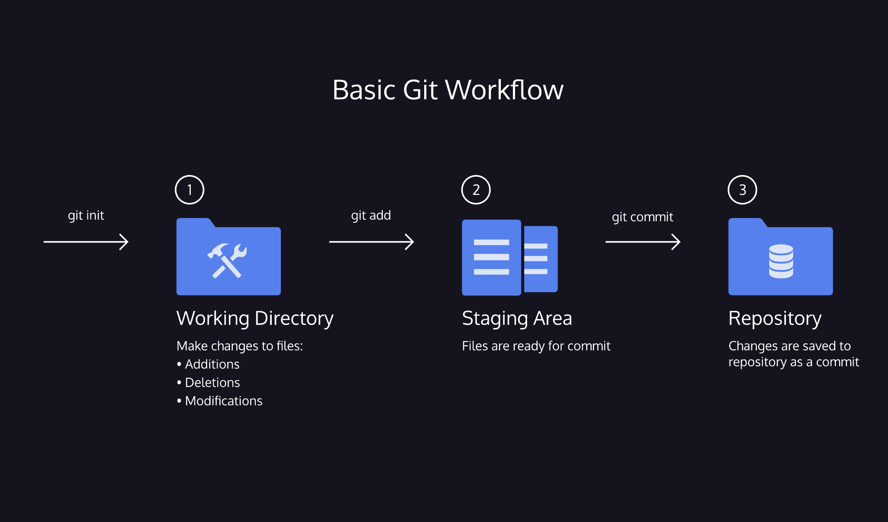

# Git
- Git is a software that allows you to keep track of changes made to a project over time. Git works by recording the changes you make to a project, storing those changes, then allowing you to reference them as needed.
- [Git cheatsheet](./resources/git-cheat-sheet-education.pdf)

## Git Basic Workflow
- [cheatsheet](./resources/basic_git_workflow.pdf)

- `git init` creates a new Git repository
- `git status` inspects the contents of the working directory and staging area
- `git add` adds files from the working directory to the staging area
- `git diff` shows the difference between the working directory and the staging area
- `git commit` permanently stores file changes from the staging area in the repository
- `git log` shows a list of all previous commits

## How To BackTrack
- `git checkout HEAD filename`: Discards changes in the working directory.
- `git reset HEAD filename`: Unstages file changes in the staging area.
- `git reset commit_SHA`: Resets to a previous commit in your commit history.
- `git stash` & `git stash pop` You’re “stashing” your local work temporarily in order to update a previous commit and later on retrieve your work.

### Handy Git Operations

#### Git Log
- `git log --oneline` shows the list of commits in one line format.
- `git log -S "keyword"` displays a list of commits that contain the keyword in the message. In the screenshot below, we use `git log -S "Add"` to find any commits with “Add” in the message.
- `git log --oneline --graph - --graph` Displays a visual representation of how the branches and commits were created in order to help you make sense of your repository history. When used alone, the description can be very lengthy, so you can combine the command with `--oneline` in order to shorten the description.

#### Git commit amend
- `git commit --amend`

#### Git alias commands

- $ `git config --global alias.co "checkout"`
- $ `git config --global alias.br "branch"`
- $ `git config --global alias.glop "log --pretty=format:"%h %s" --graph"`