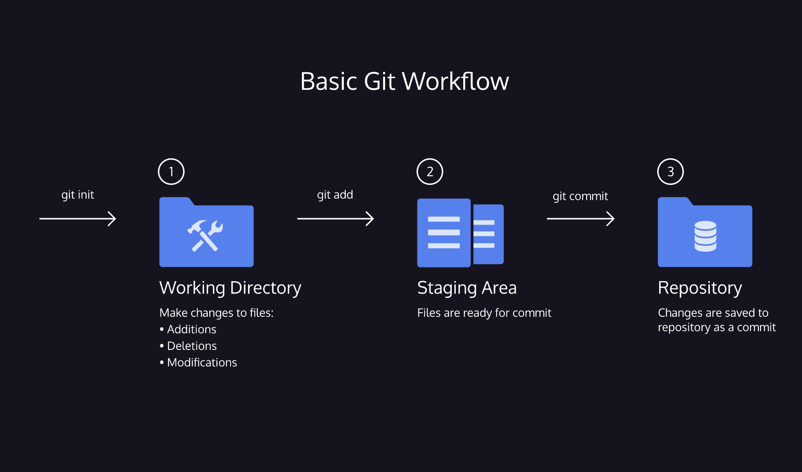

# Git
- Git is a software that allows you to keep track of changes made to a project over time. Git works by recording the changes you make to a project, storing those changes, then allowing you to reference them as needed.

## Git Basic Workflow
[cheatsheet](./basic_git_workflow.pdf)

- **git init** creates a new Git repository
- **git status** inspects the contents of the working directory and staging area
- **git add** adds files from the working directory to the staging area
- **git diff** shows the difference between the working directory and the staging area
- **git commit** permanently stores file changes from the staging area in the repository
- **git log** shows a list of all previous commits