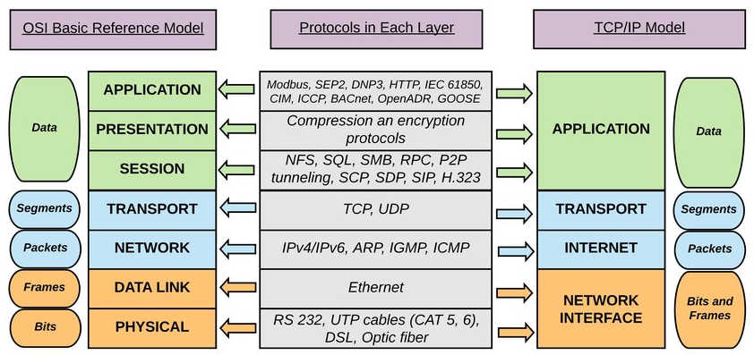
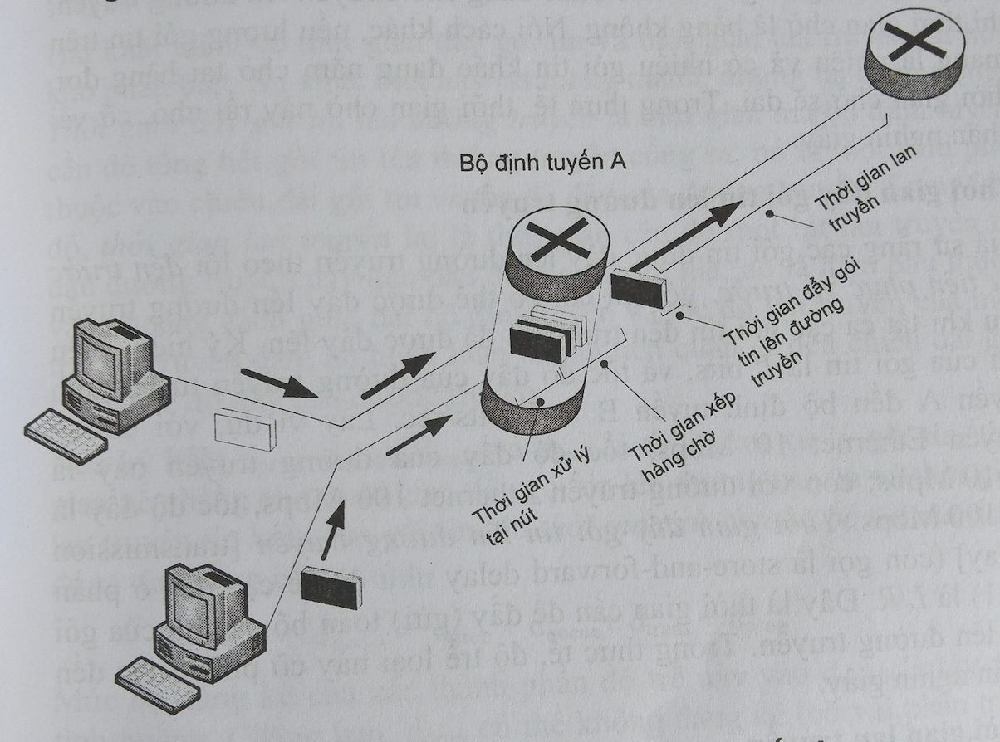

# Internet Introduction
- **Internet là một mạng các hệ cuối(host / end system) kết nối hàng trăm triệu thiết bị tính toán khắp nơi trên thế giới.**

# Cách các gói tin được chuyền qua internet

# What is a network protocol?
- **In networking, a protocol is a set of rules for formatting and processing data.Enables hosts to communicate with each other.**
- Giao thức định nghĩa **khuôn dạng và thứ tự** các thông điệp được trao đổi giữa 2 hoặc nhiều thực thể truyền thông, cũng như **những hành động cần được thực hiện** khi truyền, nhận thông điệp hoặc khi có một sự kiện khác xãy ra.

# IOS Model: The 7 layers of Network Architecture

# Virus, Worm, Trojan horse, ...

|                   | Virus                                                                                                                        | Worm                                                           | Trojan Horse                                                                                                         |
| ----------------- | ---------------------------------------------------------------------------------------------------------------------------- | -------------------------------------------------------------- | -------------------------------------------------------------------------------------------------------------------- |
| Definition        | Virus is a software or computer program that connect itself to another software or computer program to harm computer system. | Worms replicate itself to cause slow down the computer system. | Trojan Horse rather than replicate capture some important information about a computer system or a computer network. |
| Replicates itself | Yes                                                                                                                          | Yes                                                            | No                                                                                                                   |
| Control by remote | No                                                                                                                           | Yes                                                            | Yes                                                                                                                  |
| Spreading rate    | Moderate                                                                                                                     | Fast                                                           | Slow                                                                                                                 |
| Main objective    | Modify the information                                                                                                       | Eat the system resources                                       | Steal the information                                                                                                |
| Executed via      | Executable files                                                                                                             | Weaknesses in system                                           | Through a program and interprets as utility software                                                                 |

ref: [Different between virus, worm, and trojan](https://www.geeksforgeeks.org/difference-between-virus-worm-and-trojan-horse/)

# Access network technics

- Dial-up (Quay số)
- DSL (digital subscriber line)
- Cable (Cáp)
- FTTH (Fiber-To-The-Home) (Cáp quang)
- Ethernet
- Wifi
- WiMax

# Circuit switching vs Package switching

[Circuit switching vs Package switching](./circuit-vs-packet-switching.md)

# Độ trễ gói tin / package delay

### Các loại độ trễ:
- **Processing delay** (Thời gian xử lý tại nút)
- **Queuing delay** (Độ trễ do xếp hàng)
- **Transmission delay** (Thời gian đẩy gói tin lên đường truyền)
- **Propagation delay** (Thời gian lan truyền)

### Hiện tượng mất gói tin: **Queue overflow**