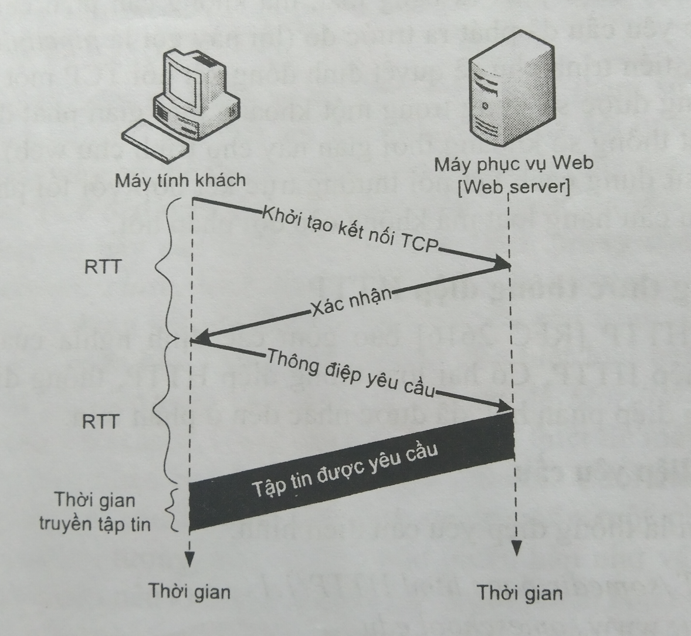
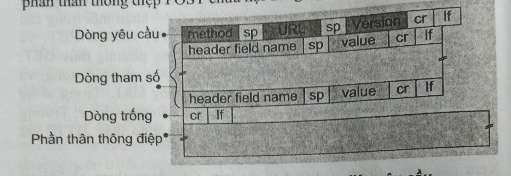
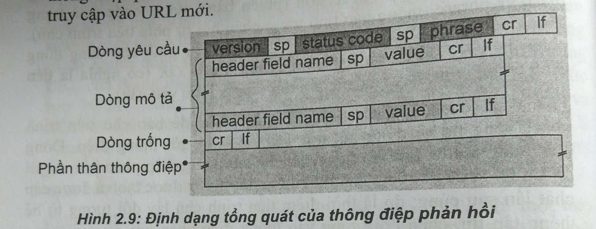

# Web & HTTP Protocol (Hypertext transfer protocol)

- **Stateless protocol** - Because server don't hold any state of client
- Use **TCP** in transport layer
- Main protocol of client - server architecture application

## Bắt tay 3 bước (three way - handsake)

## Kết nối thường trực và kết nối không thường trực
- Kết nối không thường trực (non-persistent connection:    
  - 1 TCP connection - 1 Req
- Kết nối thường trực (persistent connection): 
  - 1 TCP connection - N Req
  - Server will disconnect TCP connection when it's not being used after 1 amount of time (server set this time).

**=> Default: HTTP use persistent connection + multi request without waiting for response.**

## Dạng thức thông điệp HTTP

### HTTP request

### HTTP response
